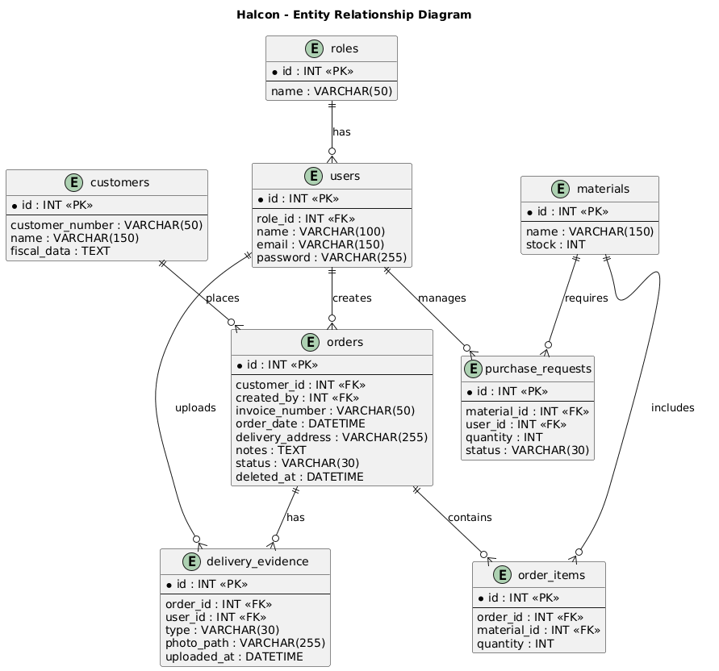

# Halcon Web Application

## Project Name

Halcon Web Application

## Project Description

Halcon Web Application is a web-based system designed to support the order management process of a construction materials distribution company.

The system allows the company to manage customers, users, materials, orders, purchase requests, and delivery evidence. It is designed to improve the organization and tracking of customer orders from the moment they are created until they are delivered.

The application is being developed with Laravel and uses a relational database structure to organize the main business entities and their relationships.

## Main Entities

- Roles
- Users
- Customers
- Orders
- Materials
- Order Items
- Purchase Requests
- Delivery Evidence

## Database Population

The project includes:

- A UserSeeder that creates three users.
- A CustomerSeeder that creates the customers required to generate orders.
- An OrderFactory that uses FakerPHP to generate realistic fake order data.
- An OrderSeeder that creates 50 orders.

## ER Diagram

## Documentation

The repository also contains the documentation and diagrams created during Evidence 1, including:

- BPMN Diagram
- Activity Diagram
- Class Diagram
- Use Case Diagram
- ER Diagram

## Technologies

- Laravel
- PHP
- MySQL
- FakerPHP
- Git
- GitHub